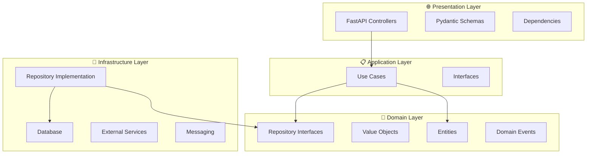

# Autenticação e Autorização

Implementar um sistema completo de autenticação JWT com autorização baseada em roles, incluindo middleware de segurança e proteção de endpoints.

## 🎯 O que você vai aprender

- Implementar autenticação JWT
- Criar sistema de roles e permissões
- Configurar middleware de segurança
- Proteger endpoints com dependências
- Hash seguro de senhas
- Refresh tokens e logout
- **Arquitetura Avançada:** Clean Architecture, DDD, Repository Pattern e Use Cases

---

## 🏗️ Arquitetura Avançada e Design Patterns

### Clean Architecture com FastAPI

A Clean Architecture organiza o código em camadas concêntricas, onde as dependências apontam sempre para dentro (das camadas externas para as internas).



### Estrutura de Diretórios

```
src/
├── domain/                # 🎯 Camada de Domínio
│   ├── entities/         # Entidades de negócio
│   ├── value_objects/    # Objetos de valor
│   ├── repositories/     # Interfaces dos repositórios
│   └── events/           # Eventos de domínio
├── application/          # 📋 Camada de Aplicação
│   ├── use_cases/        # Casos de uso
│   ├── interfaces/       # Interfaces de serviços
│   └── dto/              # Data Transfer Objects
├── infrastructure/       # 🔧 Camada de Infraestrutura
│   ├── database/         # Configuração do banco
│   ├── external/         # Serviços externos
│   ├── repositories/     # Implementação dos repositórios
│   └── messaging/        # Sistema de mensageria
└── presentation/          # 🌐 Camada de Apresentação
    ├── api/              # Controllers FastAPI
    ├── schemas/          # Schemas de entrada/saída
    └── dependencies/     # Injeção de dependências
```

---

## 🎯 Entidades de Domínio

### Entidade User

```python
# src/domain/entities/user.py
from dataclasses import dataclass
from typing import Optional
from datetime import datetime
from enum import Enum

class UserStatus(Enum):
    ACTIVE = "active"
    INACTIVE = "inactive"
    SUSPENDED = "suspended"
    PENDING_VERIFICATION = "pending_verification"

@dataclass
class User:
    """Entidade User - representa um usuário no domínio"""
    id: int | None
    email: str
    username: str
    full_name: str
    status: UserStatus
    created_at: datetime | None = None
    updated_at: datetime | None = None
    last_login: datetime | None = None
    
    def activate(self):
        """Regra de negócio: ativar usuário"""
        if self.status == UserStatus.SUSPENDED:
            raise ValueError("Cannot activate suspended user")
        
        self.status = UserStatus.ACTIVE
        self.updated_at = datetime.now()
    
    def suspend(self, reason: str = None):
        """Regra de negócio: suspender usuário"""
        if not self.is_active():
            raise ValueError("Can only suspend active users")
        
        self.status = UserStatus.SUSPENDED
        self.updated_at = datetime.now()
        
        # Emitir evento de domínio
        from domain.events.user_events import UserSuspendedEvent
        return UserSuspendedEvent(user_id=self.id, reason=reason)
    
    def is_active(self) -> bool:
        """Verificar se usuário está ativo"""
        return self.status == UserStatus.ACTIVE
    
    def can_login(self) -> bool:
        """Regra de negócio: usuário pode fazer login?"""
        return self.status in [UserStatus.ACTIVE]
    
    def update_last_login(self):
        """Atualizar último login"""
        self.last_login = datetime.now()
        self.updated_at = datetime.now()
```

### Value Objects

```python
# src/domain/value_objects/email.py
from dataclasses import dataclass
import re

@dataclass(frozen=True)
class Email:
    """Value Object para email"""
    value: str
    
    def __post_init__(self):
        if not self._is_valid_email(self.value):
            raise ValueError(f"Invalid email: {self.value}")
    
    def _is_valid_email(self, email: str) -> bool:
        pattern = r'^[a-zA-Z0-9._%+-]+@[a-zA-Z0-9.-]+\.[a-zA-Z]{2,}$'
        return re.match(pattern, email) is not None
    
    def domain(self) -> str:
        """Extrair domínio do email"""
        return self.value.split('@')[1]
    
    def is_corporate(self) -> bool:
        """Verificar se é email corporativo"""
        corporate_domains = ['gmail.com', 'yahoo.com', 'hotmail.com']
        return self.domain() not in corporate_domains

# src/domain/value_objects/money.py
from dataclasses import dataclass
from decimal import Decimal
from typing import Union

@dataclass(frozen=True)
class Money:
    """Value Object para valores monetários"""
    amount: Decimal
    currency: str = "BRL"
    
    def __post_init__(self):
        if self.amount < 0:
            raise ValueError("Money amount cannot be negative")
        if not self.currency:
            raise ValueError("Currency is required")
    
    def add(self, other: 'Money') -> 'Money':
        """Somar valores monetários"""
        if self.currency != other.currency:
            raise ValueError("Cannot add different currencies")
        
        return Money(self.amount + other.amount, self.currency)
    
    def multiply(self, factor: Union[int, float, Decimal]) -> 'Money':
        """Multiplicar valor"""
        return Money(self.amount * Decimal(str(factor)), self.currency)
    
    def is_zero(self) -> bool:
        """Verificar se valor é zero"""
        return self.amount == 0
```

---

## 🔧 Casos de Uso (Use Cases)

### User Use Cases

```python
# src/application/use_cases/user_use_cases.py
from abc import ABC, abstractmethod
from typing import Optional
from domain.entities.user import User, UserStatus
from domain.value_objects.email import Email
from domain.repositories.user_repository import UserRepositoryInterface
from application.interfaces.email_service import EmailServiceInterface

class CreateUserUseCase:
    """Caso de uso: criar novo usuário"""
    
    def __init__(
        self, 
        user_repository: UserRepositoryInterface,
        email_service: EmailServiceInterface
    ):
        self.user_repository = user_repository
        self.email_service = email_service
    
    async def execute(self, email: str, username: str, full_name: str) -> User:
        """Executar caso de uso"""
        
        # Validar email
        email_vo = Email(email)
        
        # Validações de negócio
        existing_user = await self.user_repository.find_by_email(email)
        if existing_user:
            raise ValueError("User with this email already exists")
        
        existing_username = await self.user_repository.find_by_username(username)
        if existing_username:
            raise ValueError("Username already taken")
        
        # Criar entidade
        user = User(
            id=None,
            email=email,
            username=username,
            full_name=full_name,
            status=UserStatus.PENDING_VERIFICATION
        )
        
        # Persistir
        saved_user = await self.user_repository.save(user)
        
        # Enviar email de verificação
        await self.email_service.send_verification_email(saved_user)
        
        return saved_user

class AuthenticateUserUseCase:
    """Caso de uso: autenticar usuário"""
    
    def __init__(self, user_repository: UserRepositoryInterface):
        self.user_repository = user_repository
    
    async def execute(self, username: str, password: str) -> User | None:
        """Executar autenticação"""
        
        # Buscar usuário
        user = await self.user_repository.find_by_username(username)
        if not user:
            raise ValueError("Invalid credentials")
        
        # Verificar se pode fazer login
        if not user.can_login():
            raise ValueError("User cannot login")
        
        # Verificar senha (implementar hash)
        # if not self._verify_password(password, user.password_hash):
        #     raise ValueError("Invalid credentials")
        
        # Atualizar último login
        user.update_last_login()
        await self.user_repository.save(user)
        
        return user

class SuspendUserUseCase:
    """Caso de uso: suspender usuário"""
    
    def __init__(self, user_repository: UserRepositoryInterface):
        self.user_repository = user_repository
    
    async def execute(self, user_id: int, reason: str = None) -> User:
        """Executar suspensão"""
        user = await self.user_repository.find_by_id(user_id)
        
        if not user:
            raise ValueError("User not found")
        
        # Aplicar regra de negócio
        event = user.suspend(reason)
        
        # Persistir mudança
        updated_user = await self.user_repository.save(user)
        
        # Publicar evento (se necessário)
        # await self.event_publisher.publish(event)
        
        return updated_user
```

---

## 🗄️ Repository Pattern

### Interface do Repositório

```python
# src/domain/repositories/user_repository.py
from abc import ABC, abstractmethod
from typing import Optional
from domain.entities.user import User

class UserRepositoryInterface(ABC):
    """Interface do repositório de usuários"""
    
    @abstractmethod
    async def save(self, user: User) -> User:
        """Salvar usuário"""
        pass
    
    @abstractmethod
    async def find_by_id(self, user_id: int) -> Optional[User]:
        """Buscar usuário por ID"""
        pass
    
    @abstractmethod
    async def find_by_email(self, email: str) -> Optional[User]:
        """Buscar usuário por email"""
        pass
    
    @abstractmethod
    async def find_by_username(self, username: str) -> User | None:
        """Buscar usuário por username"""
        pass
    
    @abstractmethod
    async def find_all(
        self, 
        skip: int = 0, 
        limit: int = 100
    ) -> list[User]:
        """Listar usuários com paginação"""
        pass
    
    @abstractmethod
    async def delete(self, user_id: int) -> bool:
        """Deletar usuário"""
        pass
    
    @abstractmethod
    async def count(self) -> int:
        """Contar total de usuários"""
        pass
```

### Implementação SQLAlchemy

```python
# src/infrastructure/repositories/sqlalchemy_user_repository.py
from sqlalchemy.orm import Session
from sqlalchemy import func
from typing import Optional
from domain.repositories.user_repository import UserRepositoryInterface
from domain.entities.user import User, UserStatus
from infrastructure.database.models import UserModel

class SQLAlchemyUserRepository(UserRepositoryInterface):
    """Implementação do repositório usando SQLAlchemy"""
    
    def __init__(self, session: Session):
        self.session = session
    
    async def save(self, user: User) -> User:
        """Salvar usuário"""
        if user.id is None:
            # Criar novo
            db_user = UserModel(
                email=user.email,
                username=user.username,
                full_name=user.full_name,
                status=user.status.value
            )
            self.session.add(db_user)
        else:
            # Atualizar existente
            db_user = self.session.query(UserModel).filter(
                UserModel.id == user.id
            ).first()
            
            if db_user:
                db_user.email = user.email
                db_user.username = user.username
                db_user.full_name = user.full_name
                db_user.status = user.status.value
                db_user.updated_at = user.updated_at
                db_user.last_login = user.last_login
        
        self.session.commit()
        self.session.refresh(db_user)
        
        # Converter para entidade de domínio
        return self._to_domain_entity(db_user)
    
    async def find_by_id(self, user_id: int) -> Optional[User]:
        """Buscar usuário por ID"""
        db_user = self.session.query(UserModel).filter(
            UserModel.id == user_id
        ).first()
        
        return self._to_domain_entity(db_user) if db_user else None
    
    async def find_by_email(self, email: str) -> Optional[User]:
        """Buscar usuário por email"""
        db_user = self.session.query(UserModel).filter(
            UserModel.email == email
        ).first()
        
        return self._to_domain_entity(db_user) if db_user else None
    
    async def find_by_username(self, username: str) -> Optional[User]:
        """Buscar usuário por username"""
        db_user = self.session.query(UserModel).filter(
            UserModel.username == username
        ).first()
        
        return self._to_domain_entity(db_user) if db_user else None
    
    async def find_all(self, skip: int = 0, limit: int = 100) -> List[User]:
        """Listar usuários com paginação"""
        db_users = self.session.query(UserModel).offset(skip).limit(limit).all()
        
        return [self._to_domain_entity(db_user) for db_user in db_users]
    
    async def delete(self, user_id: int) -> bool:
        """Deletar usuário"""
        db_user = self.session.query(UserModel).filter(
            UserModel.id == user_id
        ).first()
        
        if db_user:
            self.session.delete(db_user)
            self.session.commit()
            return True
        
        return False
    
    async def count(self) -> int:
        """Contar total de usuários"""
        return self.session.query(func.count(UserModel.id)).scalar()
    
    def _to_domain_entity(self, db_user: UserModel) -> User:
        """Converter modelo do banco para entidade de domínio"""
        return User(
            id=db_user.id,
            email=db_user.email,
            username=db_user.username,
            full_name=db_user.full_name,
            status=UserStatus(db_user.status),
            created_at=db_user.created_at,
            updated_at=db_user.updated_at,
            last_login=db_user.last_login
        )
```

---

## 🌐 Controllers FastAPI

### User Controller

```python
# src/presentation/api/user_controller.py
from fastapi import APIRouter, Depends, HTTPException, status
from typing import Optional
from application.use_cases.user_use_cases import (
    CreateUserUseCase, 
    AuthenticateUserUseCase,
    SuspendUserUseCase
)
from presentation.schemas.user_schemas import (
    UserCreateRequest, 
    UserResponse, 
    UserListResponse,
    LoginRequest,
    LoginResponse
)
from presentation.dependencies.user_dependencies import (
    get_create_user_use_case,
    get_authenticate_user_use_case,
    get_suspend_user_use_case
)

router = APIRouter(prefix="/users", tags=["Users"])

@router.post(
    "/", 
    response_model=UserResponse,
    status_code=status.HTTP_201_CREATED,
    summary="Criar usuário"
)
async def create_user(
    request: UserCreateRequest,
    use_case: CreateUserUseCase = Depends(get_create_user_use_case)
):
    """
    Criar um novo usuário no sistema.
    
    - **email**: Email único do usuário
    - **username**: Nome de usuário único
    - **full_name**: Nome completo do usuário
    """
    try:
        user = await use_case.execute(
            email=request.email,
            username=request.username,
            full_name=request.full_name
        )
        
        return UserResponse.from_domain_entity(user)
    
    except ValueError as e:
        raise HTTPException(
            status_code=status.HTTP_400_BAD_REQUEST,
            detail=str(e)
        )

@router.post(
    "/login",
    response_model=LoginResponse,
    summary="Autenticar usuário"
)
async def login(
    request: LoginRequest,
    use_case: AuthenticateUserUseCase = Depends(get_authenticate_user_use_case)
):
    """
    Autenticar usuário no sistema.
    
    - **username**: Nome de usuário ou email
    - **password**: Senha do usuário
    """
    try:
        user = await use_case.execute(
            username=request.username,
            password=request.password
        )
        
        # Gerar token JWT (implementar)
        token = "fake-jwt-token"
        
        return LoginResponse(
            access_token=token,
            token_type="bearer",
            user=UserResponse.from_domain_entity(user)
        )
    
    except ValueError as e:
        raise HTTPException(
            status_code=status.HTTP_401_UNAUTHORIZED,
            detail=str(e)
        )

@router.patch(
    "/{user_id}/suspend",
    response_model=UserResponse,
    summary="Suspender usuário"
)
async def suspend_user(
    user_id: int,
    reason: str = None,
    use_case: SuspendUserUseCase = Depends(get_suspend_user_use_case)
):
    """
    Suspender um usuário do sistema.
    
    - **user_id**: ID do usuário a ser suspenso
    - **reason**: Motivo da suspensão (opcional)
    """
    try:
        user = await use_case.execute(user_id=user_id, reason=reason)
        
        return UserResponse.from_domain_entity(user)
    
    except ValueError as e:
        raise HTTPException(
            status_code=status.HTTP_400_BAD_REQUEST,
            detail=str(e)
        )
```

---

## 🔌 Dependency Injection

### Configuração de Dependências

```python
# src/presentation/dependencies/user_dependencies.py
from fastapi import Depends
from sqlalchemy.orm import Session
from application.use_cases.user_use_cases import (
    CreateUserUseCase,
    AuthenticateUserUseCase, 
    SuspendUserUseCase
)
from infrastructure.repositories.sqlalchemy_user_repository import SQLAlchemyUserRepository
from infrastructure.services.email_service import EmailService
from core.database import get_db

def get_user_repository(db: Session = Depends(get_db)) -> SQLAlchemyUserRepository:
    """Dependência para repositório de usuários"""
    return SQLAlchemyUserRepository(db)

def get_email_service() -> EmailService:
    """Dependência para serviço de email"""
    return EmailService()

def get_create_user_use_case(
    user_repository: SQLAlchemyUserRepository = Depends(get_user_repository),
    email_service: EmailService = Depends(get_email_service)
) -> CreateUserUseCase:
    """Dependência para caso de uso de criação de usuário"""
    return CreateUserUseCase(user_repository, email_service)

def get_authenticate_user_use_case(
    user_repository: SQLAlchemyUserRepository = Depends(get_user_repository)
) -> AuthenticateUserUseCase:
    """Dependência para caso de uso de autenticação"""
    return AuthenticateUserUseCase(user_repository)

def get_suspend_user_use_case(
    user_repository: SQLAlchemyUserRepository = Depends(get_user_repository)
) -> SuspendUserUseCase:
    """Dependência para caso de uso de suspensão"""
    return SuspendUserUseCase(user_repository)
```

---

## 📊 Schemas de Apresentação

```python
# src/presentation/schemas/user_schemas.py
from pydantic import BaseModel, Field, EmailStr
from typing import Optional
from datetime import datetime
from domain.entities.user import User, UserStatus

class UserCreateRequest(BaseModel):
    """Schema para criação de usuário"""
    email: EmailStr = Field(..., description="Email do usuário")
    username: str = Field(..., min_length=3, max_length=50, description="Nome de usuário")
    full_name: str = Field(..., min_length=2, max_length=200, description="Nome completo")

class LoginRequest(BaseModel):
    """Schema para login"""
    username: str = Field(..., description="Username ou email")
    password: str = Field(..., min_length=8, description="Senha")

class UserResponse(BaseModel):
    """Schema de resposta para usuário"""
    id: int
    email: str
    username: str
    full_name: str
    status: UserStatus
    created_at: datetime
    updated_at: datetime | None = None
    last_login: datetime | None = None
    
    @classmethod
    def from_domain_entity(cls, user: User) -> 'UserResponse':
        """Converter entidade de domínio para schema de resposta"""
        return cls(
            id=user.id,
            email=user.email,
            username=user.username,
            full_name=user.full_name,
            status=user.status,
            created_at=user.created_at,
            updated_at=user.updated_at,
            last_login=user.last_login
        )
    
    class Config:
        from_attributes = True

class LoginResponse(BaseModel):
    """Schema de resposta para login"""
    access_token: str
    token_type: str = "bearer"
    user: UserResponse

class UserListResponse(BaseModel):
    """Schema para lista de usuários"""
    users: List[UserResponse]
    total: int
    skip: int
    limit: int
```

---

## 🧪 Testando a Arquitetura

### Teste de Use Case

```python
# tests/unit/test_user_use_cases.py
import pytest
from unittest.mock import Mock, AsyncMock
from application.use_cases.user_use_cases import CreateUserUseCase
from domain.entities.user import User, UserStatus

@pytest.mark.asyncio
async def test_create_user_success():
    """Teste de criação de usuário com sucesso"""
    
    # Arrange
    user_repository = Mock()
    email_service = Mock()
    
    user_repository.find_by_email = AsyncMock(return_value=None)
    user_repository.find_by_username = AsyncMock(return_value=None)
    user_repository.save = AsyncMock(return_value=User(
        id=1,
        email="test@example.com",
        username="testuser",
        full_name="Test User",
        status=UserStatus.PENDING_VERIFICATION
    ))
    email_service.send_verification_email = AsyncMock()
    
    use_case = CreateUserUseCase(user_repository, email_service)
    
    # Act
    result = await use_case.execute(
        email="test@example.com",
        username="testuser",
        full_name="Test User"
    )
    
    # Assert
    assert result.email == "test@example.com"
    assert result.username == "testuser"
    assert result.status == UserStatus.PENDING_VERIFICATION
    user_repository.save.assert_called_once()
    email_service.send_verification_email.assert_called_once()

@pytest.mark.asyncio
async def test_create_user_email_already_exists():
    """Teste de criação com email já existente"""
    
    # Arrange
    user_repository = Mock()
    email_service = Mock()
    
    existing_user = User(
        id=1,
        email="test@example.com",
        username="existing",
        full_name="Existing User",
        status=UserStatus.ACTIVE
    )
    
    user_repository.find_by_email = AsyncMock(return_value=existing_user)
    
    use_case = CreateUserUseCase(user_repository, email_service)
    
    # Act & Assert
    with pytest.raises(ValueError, match="User with this email already exists"):
        await use_case.execute(
            email="test@example.com",
            username="testuser",
            full_name="Test User"
        )
```

---

## 🔐 Configuração de Segurança

### Dependências de Segurança

```bash
pip install python-jose[cryptography] passlib[bcrypt] python-multipart
```

### Configurações de Segurança (core/security.py)

```python
from datetime import datetime, timedelta
from typing import Optional, Union, Any
from jose import JWTError, jwt
from passlib.context import CryptContext
from pydantic import BaseSettings
import secrets

class SecuritySettings(BaseSettings):
    # JWT Configuration
    SECRET_KEY: str = secrets.token_urlsafe(32)
    ALGORITHM: str = "HS256"
    ACCESS_TOKEN_EXPIRE_MINUTES: int = 30
    REFRESH_TOKEN_EXPIRE_DAYS: int = 7
    
    # Password Configuration
    PWD_CONTEXT_SCHEMES: list = ["bcrypt"]
    PWD_CONTEXT_DEPRECATED: str = "auto"
    
    # Security Headers
    CORS_ORIGINS: list = ["http://localhost:3000", "http://localhost:8000"]
    CORS_ALLOW_CREDENTIALS: bool = True
    CORS_ALLOW_METHODS: list = ["*"]
    CORS_ALLOW_HEADERS: list = ["*"]
    
    class Config:
        env_file = ".env"
        case_sensitive = True

security_settings = SecuritySettings()

# Configurar contexto de senha
pwd_context = CryptContext(
    schemes=security_settings.PWD_CONTEXT_SCHEMES,
    deprecated=security_settings.PWD_CONTEXT_DEPRECATED
)

def verify_password(plain_password: str, hashed_password: str) -> bool:
    """Verificar senha"""
    return pwd_context.verify(plain_password, hashed_password)

def get_password_hash(password: str) -> str:
    """Gerar hash da senha"""
    return pwd_context.hash(password)

def create_access_token(
    data: dict, 
    expires_delta: Optional[timedelta] = None
) -> str:
    """Criar token de acesso JWT"""
    to_encode = data.copy()
    
    if expires_delta:
        expire = datetime.utcnow() + expires_delta
    else:
        expire = datetime.utcnow() + timedelta(
            minutes=security_settings.ACCESS_TOKEN_EXPIRE_MINUTES
        )
    
    to_encode.update({"exp": expire, "type": "access"})
    encoded_jwt = jwt.encode(
        to_encode, 
        security_settings.SECRET_KEY, 
        algorithm=security_settings.ALGORITHM
    )
    return encoded_jwt

def create_refresh_token(data: dict) -> str:
    """Criar refresh token"""
    to_encode = data.copy()
    expire = datetime.utcnow() + timedelta(
        days=security_settings.REFRESH_TOKEN_EXPIRE_DAYS
    )
    to_encode.update({"exp": expire, "type": "refresh"})
    
    encoded_jwt = jwt.encode(
        to_encode,
        security_settings.SECRET_KEY,
        algorithm=security_settings.ALGORITHM
    )
    return encoded_jwt

def verify_token(token: str, token_type: str = "access") -> Optional[dict]:
    """Verificar e decodificar token"""
    try:
        payload = jwt.decode(
            token,
            security_settings.SECRET_KEY,
            algorithms=[security_settings.ALGORITHM]
        )
        
        # Verificar tipo do token
        if payload.get("type") != token_type:
            return None
            
        return payload
    except JWTError:
        return None
```

---

## 👤 Modelos de Usuário e Roles

### Modelo de Role (db/models/role.py)

```python
from sqlalchemy import Column, String, Boolean, Text
from sqlalchemy.orm import relationship
from db.models.base import BaseModel

class Role(BaseModel):
    __tablename__ = "roles"
    
    name = Column(String(50), unique=True, nullable=False, index=True)
    description = Column(Text, nullable=True)
    is_active = Column(Boolean, default=True, nullable=False)
    
    # Relacionamentos
    users = relationship("User", back_populates="role")
    permissions = relationship("Permission", secondary="role_permissions", back_populates="roles")
    
    def __repr__(self):
        return f"<Role(id={self.id}, name='{self.name}')>"
```

### Modelo de Permissão (db/models/permission.py)

```python
from sqlalchemy import Column, String, Text, Boolean, Table, ForeignKey
from sqlalchemy.orm import relationship
from db.models.base import BaseModel
from db.session import Base

# Tabela de associação many-to-many
role_permissions = Table(
    'role_permissions',
    Base.metadata,
    Column('role_id', ForeignKey('roles.id'), primary_key=True),
    Column('permission_id', ForeignKey('permissions.id'), primary_key=True)
)

class Permission(BaseModel):
    __tablename__ = "permissions"
    
    name = Column(String(100), unique=True, nullable=False, index=True)
    resource = Column(String(50), nullable=False)  # users, items, orders
    action = Column(String(20), nullable=False)    # create, read, update, delete
    description = Column(Text, nullable=True)
    is_active = Column(Boolean, default=True, nullable=False)
    
    # Relacionamentos
    roles = relationship("Role", secondary=role_permissions, back_populates="permissions")
    
    def __repr__(self):
        return f"<Permission(id={self.id}, name='{self.name}')>"
    
    @property
    def full_name(self):
        return f"{self.resource}:{self.action}"
```

### Modelo de Usuário Atualizado (db/models/user.py)

```python
from sqlalchemy import Column, String, Boolean, DateTime, Integer, ForeignKey
from sqlalchemy.orm import relationship
from db.models.base import BaseModel

class User(BaseModel):
    __tablename__ = "users"
    
    email = Column(String(255), unique=True, index=True, nullable=False)
    username = Column(String(50), unique=True, index=True, nullable=False)
    full_name = Column(String(100), nullable=True)
    hashed_password = Column(String(255), nullable=False)
    is_active = Column(Boolean, default=True)
    is_superuser = Column(Boolean, default=False)
    last_login = Column(DateTime(timezone=True), nullable=True)
    
    # Foreign Key para Role
    role_id = Column(Integer, ForeignKey("roles.id"), nullable=True)
    
    # Relacionamentos
    role = relationship("Role", back_populates="users")
    
    def __repr__(self):
        return f"<User(id={self.id}, username='{self.username}', email='{self.email}')>"
    
    def has_permission(self, resource: str, action: str) -> bool:
        """Verificar se usuário tem permissão específica"""
        if self.is_superuser:
            return True
            
        if not self.role or not self.role.is_active:
            return False
            
        for permission in self.role.permissions:
            if (permission.resource == resource and 
                permission.action == action and 
                permission.is_active):
                return True
        return False
    
    def get_permissions(self) -> list:
        """Obter lista de permissões do usuário"""
        if self.is_superuser:
            return ["*:*"]  # Superuser tem todas as permissões
            
        if not self.role or not self.role.is_active:
            return []
            
        return [
            permission.full_name 
            for permission in self.role.permissions 
            if permission.is_active
        ]
```

---

## 📋 Schemas de Autenticação

### Schemas de Token (schemas/auth.py)

```python
from pydantic import BaseModel, EmailStr
from typing import Optional
from datetime import datetime

class Token(BaseModel):
    access_token: str
    refresh_token: str
    token_type: str = "bearer"
    expires_in: int

class TokenData(BaseModel):
    username: str | None = None
    user_id: int | None = None
    permissions: list[str] = []

class LoginRequest(BaseModel):
    username: str  # Pode ser username ou email
    password: str

class RefreshTokenRequest(BaseModel):
    refresh_token: str

class ChangePasswordRequest(BaseModel):
    current_password: str
    new_password: str
    confirm_password: str

class UserLogin(BaseModel):
    id: int
    username: str
    email: EmailStr
    full_name: Optional[str]
    is_active: bool
    role_name: Optional[str]
    permissions: List[str]
    last_login: Optional[datetime]
    
    class Config:
        from_attributes = True
```

### Schemas de Usuário (schemas/user.py)

```python
from pydantic import BaseModel, EmailStr, validator
from typing import Optional
from datetime import datetime

class UserBase(BaseModel):
    email: EmailStr
    username: str
    full_name: Optional[str] = None
    is_active: bool = True

class UserCreate(UserBase):
    password: str
    role_id: Optional[int] = None
    
    @validator('password')
    def validate_password(cls, v):
        if len(v) < 8:
            raise ValueError('Password must be at least 8 characters long')
        if not any(c.isupper() for c in v):
            raise ValueError('Password must contain at least one uppercase letter')
        if not any(c.islower() for c in v):
            raise ValueError('Password must contain at least one lowercase letter')
        if not any(c.isdigit() for c in v):
            raise ValueError('Password must contain at least one digit')
        return v

class UserUpdate(BaseModel):
    email: EmailStr | None = None
    username: str | None = None
    full_name: str | None = None
    is_active: bool | None = None
    role_id: int | None = None

class User(UserBase):
    id: int
    is_superuser: bool
    last_login: datetime | None
    role_name: str | None
    permissions: list[str]
    created_at: datetime
    updated_at: datetime
    
    class Config:
        from_attributes = True

class UserInDB(User):
    hashed_password: str
```

---

## 🔒 Dependências de Autenticação

### Dependências de Segurança (core/deps.py)

```python
from typing import Optional, List
from fastapi import Depends, HTTPException, status
from fastapi.security import HTTPBearer, HTTPAuthorizationCredentials
from sqlalchemy.orm import Session

from core.security import verify_token
from db.session import get_db
from db.repository.user_repository import UserRepository
from schemas.auth import TokenData
from schemas.user import User

# Configurar esquema de autenticação
security = HTTPBearer()

async def get_current_user(
    credentials: HTTPAuthorizationCredentials = Depends(security),
    db: Session = Depends(get_db)
) -> User:
    """Obter usuário atual a partir do token"""
    credentials_exception = HTTPException(
        status_code=status.HTTP_401_UNAUTHORIZED,
        detail="Could not validate credentials",
        headers={"WWW-Authenticate": "Bearer"},
    )
    
    # Verificar token
    payload = verify_token(credentials.credentials, "access")
    if payload is None:
        raise credentials_exception
    
    # Extrair dados do token
    username: str = payload.get("sub")
    user_id: int = payload.get("user_id")
    
    if username is None or user_id is None:
        raise credentials_exception
    
    # Buscar usuário no banco
    user_repo = UserRepository(db)
    user = user_repo.get(user_id)
    
    if user is None:
        raise credentials_exception
    
    # Converter para schema
    user_data = User.from_orm(user)
    user_data.role_name = user.role.name if user.role else None
    user_data.permissions = user.get_permissions()
    
    return user_data

async def get_current_active_user(
    current_user: User = Depends(get_current_user)
) -> User:
    """Verificar se usuário está ativo"""
    if not current_user.is_active:
        raise HTTPException(
            status_code=status.HTTP_400_BAD_REQUEST, 
            detail="Inactive user"
        )
    return current_user

def require_permissions(required_permissions: List[str]):
    """Decorator para exigir permissões específicas"""
    def permission_checker(
        current_user: User = Depends(get_current_active_user)
    ) -> User:
        if current_user.is_superuser:
            return current_user
            
        user_permissions = set(current_user.permissions)
        required_permissions_set = set(required_permissions)
        
        if not required_permissions_set.issubset(user_permissions):
            raise HTTPException(
                status_code=status.HTTP_403_FORBIDDEN,
                detail="Not enough permissions"
            )
        
        return current_user
    
    return permission_checker

def require_role(required_role: str):
    """Decorator para exigir role específica"""
    def role_checker(
        current_user: User = Depends(get_current_active_user)
    ) -> User:
        if current_user.is_superuser:
            return current_user
            
        if current_user.role_name != required_role:
            raise HTTPException(
                status_code=status.HTTP_403_FORBIDDEN,
                detail=f"Role '{required_role}' required"
            )
        
        return current_user
    
    return role_checker

# Aliases para facilitar uso
RequireAdmin = require_role("admin")
RequireManager = require_role("manager")
RequireUser = require_role("user")

RequireUserRead = require_permissions(["users:read"])
RequireUserWrite = require_permissions(["users:create", "users:update"])
RequireItemManage = require_permissions(["items:create", "items:update", "items:delete"])
```

---

## 🔐 Serviços de Autenticação

### Serviço de Autenticação (services/auth_service.py)

```python
from typing import Optional, Tuple
from datetime import datetime, timedelta
from sqlalchemy.orm import Session
from fastapi import HTTPException, status

from core.security import (
    verify_password, 
    get_password_hash, 
    create_access_token, 
    create_refresh_token,
    verify_token,
    security_settings
)
from db.repository.user_repository import UserRepository
from schemas.auth import Token, LoginRequest, UserLogin
from schemas.user import UserCreate, User

class AuthService:
    def __init__(self, user_repository: UserRepository):
        self.user_repository = user_repository
    
    def authenticate_user(self, username: str, password: str) -> Optional[User]:
        """Autenticar usuário por username/email e senha"""
        # Buscar por username ou email
        user = self.user_repository.get_by_username(username)
        if not user:
            user = self.user_repository.get_by_email(username)
        
        if not user:
            return None
        
        if not verify_password(password, user.hashed_password):
            return None
        
        return user
    
    def login(self, login_data: LoginRequest) -> Tuple[Token, UserLogin]:
        """Realizar login e retornar tokens"""
        # Autenticar usuário
        user = self.authenticate_user(login_data.username, login_data.password)
        
        if not user:
            raise HTTPException(
                status_code=status.HTTP_401_UNAUTHORIZED,
                detail="Incorrect username or password",
                headers={"WWW-Authenticate": "Bearer"},
            )
        
        if not user.is_active:
            raise HTTPException(
                status_code=status.HTTP_400_BAD_REQUEST,
                detail="Inactive user"
            )
        
        # Atualizar último login
        user.last_login = datetime.utcnow()
        self.user_repository.db.commit()
        
        # Criar tokens
        access_token_expires = timedelta(
            minutes=security_settings.ACCESS_TOKEN_EXPIRE_MINUTES
        )
        
        token_data = {
            "sub": user.username,
            "user_id": user.id,
            "email": user.email
        }
        
        access_token = create_access_token(
            data=token_data,
            expires_delta=access_token_expires
        )
        
        refresh_token = create_refresh_token(data=token_data)
        
        # Preparar resposta
        token_response = Token(
            access_token=access_token,
            refresh_token=refresh_token,
            token_type="bearer",
            expires_in=security_settings.ACCESS_TOKEN_EXPIRE_MINUTES * 60
        )
        
        user_response = UserLogin(
            id=user.id,
            username=user.username,
            email=user.email,
            full_name=user.full_name,
            is_active=user.is_active,
            role_name=user.role.name if user.role else None,
            permissions=user.get_permissions(),
            last_login=user.last_login
        )
        
        return token_response, user_response
    
    def refresh_access_token(self, refresh_token: str) -> Token:
        """Renovar access token usando refresh token"""
        # Verificar refresh token
        payload = verify_token(refresh_token, "refresh")
        
        if not payload:
            raise HTTPException(
                status_code=status.HTTP_401_UNAUTHORIZED,
                detail="Invalid refresh token"
            )
        
        # Buscar usuário
        user_id = payload.get("user_id")
        user = self.user_repository.get(user_id)
        
        if not user or not user.is_active:
            raise HTTPException(
                status_code=status.HTTP_401_UNAUTHORIZED,
                detail="User not found or inactive"
            )
        
        # Criar novo access token
        access_token_expires = timedelta(
            minutes=security_settings.ACCESS_TOKEN_EXPIRE_MINUTES
        )
        
        token_data = {
            "sub": user.username,
            "user_id": user.id,
            "email": user.email
        }
        
        access_token = create_access_token(
            data=token_data,
            expires_delta=access_token_expires
        )
        
        return Token(
            access_token=access_token,
            refresh_token=refresh_token,  # Manter o mesmo refresh token
            token_type="bearer",
            expires_in=security_settings.ACCESS_TOKEN_EXPIRE_MINUTES * 60
        )
    
    def register_user(self, user_data: UserCreate) -> User:
        """Registrar novo usuário"""
        # Verificar se username já existe
        if self.user_repository.get_by_username(user_data.username):
            raise HTTPException(
                status_code=status.HTTP_400_BAD_REQUEST,
                detail="Username already registered"
            )
        
        # Verificar se email já existe
        if self.user_repository.get_by_email(user_data.email):
            raise HTTPException(
                status_code=status.HTTP_400_BAD_REQUEST,
                detail="Email already registered"
            )
        
        # Hash da senha
        hashed_password = get_password_hash(user_data.password)
        
        # Criar usuário
        user_dict = user_data.dict()
        user_dict.pop('password')
        user_dict['hashed_password'] = hashed_password
        
        user = self.user_repository.create(user_dict)
        return User.from_orm(user)
    
    def change_password(
        self, 
        user_id: int, 
        current_password: str, 
        new_password: str
    ) -> bool:
        """Alterar senha do usuário"""
        user = self.user_repository.get(user_id)
        
        if not user:
            raise HTTPException(
                status_code=status.HTTP_404_NOT_FOUND,
                detail="User not found"
            )
        
        # Verificar senha atual
        if not verify_password(current_password, user.hashed_password):
            raise HTTPException(
                status_code=status.HTTP_400_BAD_REQUEST,
                detail="Incorrect current password"
            )
        
        # Atualizar senha
        new_hashed_password = get_password_hash(new_password)
        user.hashed_password = new_hashed_password
        self.user_repository.db.commit()
        
        return True
```

---

## 🛡️ Endpoints de Autenticação

### Router de Autenticação (api/v1/auth.py)

```python
from fastapi import APIRouter, Depends, HTTPException, status
from fastapi.security import HTTPBearer
from sqlalchemy.orm import Session

from core.deps import get_current_active_user, get_db
from services.auth_service import AuthService
from db.repository.user_repository import UserRepository
from schemas.auth import (
    Token, 
    LoginRequest, 
    RefreshTokenRequest, 
    ChangePasswordRequest,
    UserLogin
)
from schemas.user import UserCreate, User

router = APIRouter(prefix="/auth", tags=["Authentication"])
security = HTTPBearer()

def get_auth_service(db: Session = Depends(get_db)) -> AuthService:
    """Dependência para obter serviço de autenticação"""
    user_repo = UserRepository(db)
    return AuthService(user_repo)

@router.post("/login", response_model=dict)
async def login(
    login_data: LoginRequest,
    auth_service: AuthService = Depends(get_auth_service)
):
    """
    Realizar login e obter tokens de acesso.
    
    - **username**: Username ou email do usuário
    - **password**: Senha do usuário
    
    Retorna access_token, refresh_token e dados do usuário.
    """
    token, user = auth_service.login(login_data)
    
    return {
        "message": "Login successful",
        "token": token,
        "user": user
    }

@router.post("/refresh", response_model=Token)
async def refresh_token(
    refresh_data: RefreshTokenRequest,
    auth_service: AuthService = Depends(get_auth_service)
):
    """
    Renovar access token usando refresh token.
    
    - **refresh_token**: Token de renovação válido
    """
    return auth_service.refresh_access_token(refresh_data.refresh_token)

@router.post("/register", response_model=User)
async def register(
    user_data: UserCreate,
    auth_service: AuthService = Depends(get_auth_service)
):
    """
    Registrar novo usuário.
    
    - **email**: Email único do usuário
    - **username**: Username único
    - **password**: Senha (mín. 8 caracteres, maiúscula, minúscula, número)
    - **full_name**: Nome completo (opcional)
    """
    return auth_service.register_user(user_data)

@router.post("/change-password")
async def change_password(
    password_data: ChangePasswordRequest,
    current_user: User = Depends(get_current_active_user),
    auth_service: AuthService = Depends(get_auth_service)
):
    """
    Alterar senha do usuário atual.
    
    - **current_password**: Senha atual
    - **new_password**: Nova senha
    - **confirm_password**: Confirmação da nova senha
    """
    if password_data.new_password != password_data.confirm_password:
        raise HTTPException(
            status_code=status.HTTP_400_BAD_REQUEST,
            detail="New password and confirmation do not match"
        )
    
    success = auth_service.change_password(
        current_user.id,
        password_data.current_password,
        password_data.new_password
    )
    
    return {"message": "Password changed successfully"}

@router.get("/me", response_model=UserLogin)
async def get_current_user_info(
    current_user: User = Depends(get_current_active_user)
):
    """
    Obter informações do usuário atual.
    """
    return UserLogin(
        id=current_user.id,
        username=current_user.username,
        email=current_user.email,
        full_name=current_user.full_name,
        is_active=current_user.is_active,
        role_name=current_user.role_name,
        permissions=current_user.permissions,
        last_login=current_user.last_login
    )

@router.post("/logout")
async def logout(
    current_user: User = Depends(get_current_active_user)
):
    """
    Realizar logout (invalidar tokens no lado cliente).
    
    Nota: Em uma implementação completa, você manteria uma blacklist
    de tokens invalidados no Redis ou banco de dados.
    """
    return {"message": "Logout successful"}
```

---

## 🔒 Endpoints Protegidos

### Exemplo de Endpoints com Autorização (api/v1/items.py)

```python
from fastapi import APIRouter, Depends, HTTPException, status, Query
from sqlalchemy.orm import Session
from typing import List, Optional

from core.deps import (
    get_current_active_user,
    require_permissions,
    RequireAdmin,
    get_db
)
from services.item_service import ItemService
from db.repository.item_repository import ItemRepository
from schemas.item import Item, ItemCreate, ItemUpdate
from schemas.user import User

router = APIRouter(prefix="/items", tags=["Items"])

def get_item_service(db: Session = Depends(get_db)) -> ItemService:
    item_repo = ItemRepository(db)
    return ItemService(item_repo)

@router.get("/", response_model=dict)
async def get_items(
    skip: int = Query(0, ge=0),
    limit: int = Query(100, ge=1, le=100),
    search: str | None = Query(None),
    category_id: int | None = Query(None),
    available_only: bool = Query(False),
    # Qualquer usuário autenticado pode listar itens
    current_user: User = Depends(get_current_active_user),
    item_service: ItemService = Depends(get_item_service)
):
    """Listar itens com filtros"""
    items, total = item_service.get_items(
        skip=skip,
        limit=limit,
        search=search,
        category_id=category_id,
        available_only=available_only
    )
    
    return {
        "items": items,
        "total": total,
        "skip": skip,
        "limit": limit
    }

@router.get("/{item_id}", response_model=Item)
async def get_item(
    item_id: int,
    current_user: User = Depends(get_current_active_user),
    item_service: ItemService = Depends(get_item_service)
):
    """Obter item por ID"""
    item = item_service.get_item(item_id)
    if not item:
        raise HTTPException(
            status_code=status.HTTP_404_NOT_FOUND,
            detail="Item not found"
        )
    return item

@router.post("/", response_model=Item)
async def create_item(
    item_data: ItemCreate,
    # Apenas usuários com permissão de criar itens
    current_user: User = Depends(require_permissions(["items:create"])),
    item_service: ItemService = Depends(get_item_service)
):
    """Criar novo item"""
    return item_service.create_item(item_data)

@router.put("/{item_id}", response_model=Item)
async def update_item(
    item_id: int,
    item_data: ItemUpdate,
    # Apenas usuários com permissão de atualizar itens
    current_user: User = Depends(require_permissions(["items:update"])),
    item_service: ItemService = Depends(get_item_service)
):
    """Atualizar item existente"""
    item = item_service.update_item(item_id, item_data)
    if not item:
        raise HTTPException(
            status_code=status.HTTP_404_NOT_FOUND,
            detail="Item not found"
        )
    return item

@router.delete("/{item_id}")
async def delete_item(
    item_id: int,
    # Apenas administradores podem deletar itens
    current_user: User = Depends(RequireAdmin),
    item_service: ItemService = Depends(get_item_service)
):
    """Deletar item"""
    success = item_service.delete_item(item_id)
    if not success:
        raise HTTPException(
            status_code=status.HTTP_404_NOT_FOUND,
            detail="Item not found"
        )
    return {"message": "Item deleted successfully"}
```

---

## 🛡️ Middleware de Segurança

### Middleware de Segurança (core/middleware.py)

```python
from fastapi import Request, Response
from fastapi.middleware.base import BaseHTTPMiddleware
from fastapi.responses import JSONResponse
import time
import logging
from typing import Set
from collections import defaultdict, deque
import asyncio

logger = logging.getLogger(__name__)

class SecurityMiddleware(BaseHTTPMiddleware):
    def __init__(self, app, max_requests_per_minute: int = 60):
        super().__init__(app)
        self.max_requests_per_minute = max_requests_per_minute
        self.request_counts: dict[str, deque] = defaultdict(deque)
        self.blocked_ips: Set[str] = set()
    
    async def dispatch(self, request: Request, call_next):
        # Obter IP do cliente
        client_ip = self.get_client_ip(request)
        
        # Verificar se IP está bloqueado
        if client_ip in self.blocked_ips:
            return JSONResponse(
                status_code=429,
                content={"detail": "IP blocked due to excessive requests"}
            )
        
        # Rate limiting
        if not self.check_rate_limit(client_ip):
            logger.warning(f"Rate limit exceeded for IP: {client_ip}")
            return JSONResponse(
                status_code=429,
                content={"detail": "Rate limit exceeded"}
            )
        
        # Adicionar headers de segurança
        start_time = time.time()
        response = await call_next(request)
        process_time = time.time() - start_time
        
        # Headers de segurança
        response.headers["X-Content-Type-Options"] = "nosniff"
        response.headers["X-Frame-Options"] = "DENY"
        response.headers["X-XSS-Protection"] = "1; mode=block"
        response.headers["Strict-Transport-Security"] = "max-age=31536000; includeSubDomains"
        response.headers["X-Process-Time"] = str(process_time)
        
        return response
    
    def get_client_ip(self, request: Request) -> str:
        """Obter IP real do cliente considerando proxies"""
        forwarded_for = request.headers.get("X-Forwarded-For")
        if forwarded_for:
            return forwarded_for.split(",")[0].strip()
        
        real_ip = request.headers.get("X-Real-IP")
        if real_ip:
            return real_ip
        
        return request.client.host if request.client else "unknown"
    
    def check_rate_limit(self, client_ip: str) -> bool:
        """Verificar rate limit por IP"""
        now = time.time()
        minute_ago = now - 60
        
        # Limpar requests antigos
        while (self.request_counts[client_ip] and 
               self.request_counts[client_ip][0] < minute_ago):
            self.request_counts[client_ip].popleft()
        
        # Verificar se excedeu o limite
        if len(self.request_counts[client_ip]) >= self.max_requests_per_minute:
            # Bloquear IP por 5 minutos se exceder muito o limite
            if len(self.request_counts[client_ip]) > self.max_requests_per_minute * 2:
                self.blocked_ips.add(client_ip)
                # Remover do bloqueio após 5 minutos
                asyncio.create_task(self.unblock_ip_after_delay(client_ip, 300))
            return False
        
        # Adicionar request atual
        self.request_counts[client_ip].append(now)
        return True
    
    async def unblock_ip_after_delay(self, ip: str, delay: int):
        """Desbloquear IP após delay em segundos"""
        await asyncio.sleep(delay)
        self.blocked_ips.discard(ip)
        logger.info(f"IP {ip} unblocked after {delay} seconds")

class LoggingMiddleware(BaseHTTPMiddleware):
    async def dispatch(self, request: Request, call_next):
        start_time = time.time()
        
        # Log da requisição
        logger.info(
            f"Request: {request.method} {request.url.path} "
            f"from {request.client.host if request.client else 'unknown'}"
        )
        
        response = await call_next(request)
        
        # Log da resposta
        process_time = time.time() - start_time
        logger.info(
            f"Response: {response.status_code} "
            f"in {process_time:.4f}s"
        )
        
        return response
```

---

## 🎯 Próximos Passos

Com autenticação e autorização implementadas, você pode:

1. **Step 4:** Implementar testes automatizados
2. **Step 5:** Adicionar cache e otimizações
3. **Step 6:** Configurar WebSockets para tempo real
4. **Step 7:** Deploy e monitoramento

---

## 📝 Exercícios Práticos

### Exercício 1: Sistema de Roles
Crie um sistema completo com roles:
- Admin: todas as permissões
- Manager: gerenciar itens e usuários
- User: apenas visualizar

### Exercício 2: Auditoria
Implemente um sistema de auditoria que registra:
- Quem fez a ação
- Quando foi feita
- Que dados foram alterados

### Exercício 3: Rate Limiting Avançado
Implemente rate limiting diferenciado por:
- Tipo de usuário (admin tem mais requests)
- Endpoint (alguns endpoints têm limites menores)
- Horário (limites diferentes por período)

---

**Anterior:** [Step 2: Banco de Dados](step_2.md) | **Próximo:** [Step 4: Testes](step_4.md)
